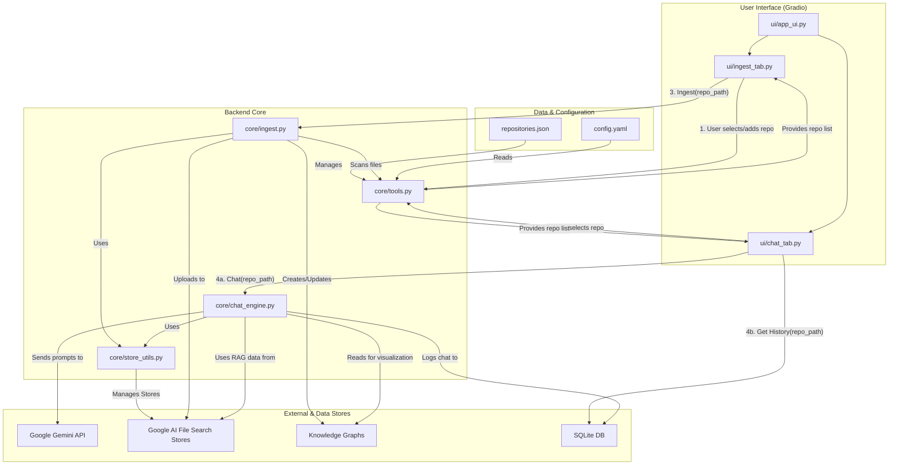

This diagram illustrates the multi-repository architecture of the Aurora Codex application. The key is that all major operations are isolated at a repository level, selected by the user in the UI.

*   **Configuration**:
    *   `config.yaml`: Main application configuration.
    *   `repositories.json`: A simple JSON file that stores the name and local path for each registered repository.

*   **User Interface (`ui/`)**:
    *   `ui/app_ui.py`: Composes the main Gradio interface with two primary tabs.
    *   `ui/ingest_tab.py`: Provides a dropdown to select a repository (from `repositories.json`) and a button to add new ones. When ingestion is triggered, it passes the selected repository's path to the backend.
    *   `ui/chat_tab.py`: Features a dropdown to switch between repository contexts. All chat interactions, history retrieval, and graph visualizations are scoped to the selected repository path.

*   **Backend Core (`core/`)**:
    *   `core/tools.py`: Contains helper functions, including the critical tools for loading the repository list from `repositories.json` and setting the active workspace path for the agent's file system tools.
    *   `core/ingest.py`: Receives a `repo_path` and handles file scanning, knowledge graph creation (`data/graphs/`), and file uploads to the appropriate data store.
    *   `core/store_utils.py`: Manages the lifecycle of Google AI File Search Stores. It ensures that each repository has its own isolated store by creating, loading, or deleting stores based on the provided `repo_path`.
    *   `core/chat_engine.py`: The main RAG and chat logic engine. It is instantiated with a specific `repo_path` and uses that path to:
        *   Interact with the correct Google AI File Search Store via `store_utils.py`.
        *   Query the corresponding knowledge graph.
        *   Filter chat history from the central SQLite database.

*   **Data Stores**:
    *   **Google AI File Search**: Each repository's vectorized data is stored in a separate, isolated File Search Store.
    *   **Knowledge Graphs**: Graph data (from AST analysis) is stored as individual JSON files in `data/graphs/`. The filename is a hash of the repository's path.
    *   **SQLite**: A single database (`aurora_history.db`) stores all chat history. A `repo_path` column is used to filter history for the UI.
