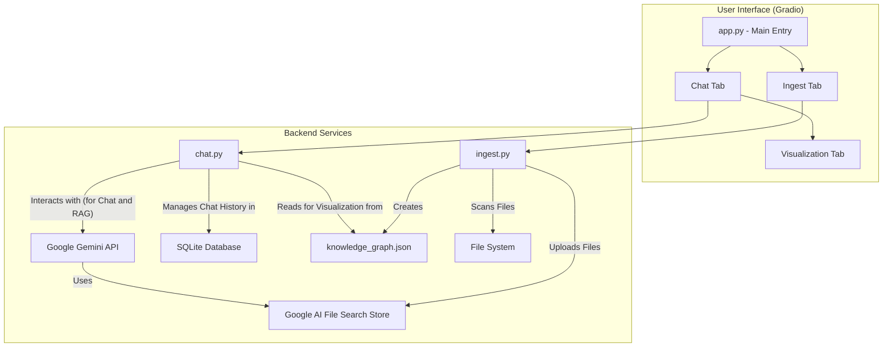

# 🌌 Aurora Codex

## An Advanced Conversational Assistant for Codebase Impact Analysis

---

## The Problem: The Complexity of Codebases

- Understanding the impact of a single change in a large, complex codebase is difficult, time-consuming, and error-prone.
- Developers spend significant time manually tracing dependencies and potential side effects.
- This manual process can be a major bottleneck in development and release cycles.

---

## Introducing: Aurora Codex

A conversational AI assistant that transforms codebase analysis.

- **Ask questions in natural language:** "What is the impact of changing this function?"
- **Leverages cutting-edge technology:**
    - Google Gemini API for Retrieval-Augmented Generation (RAG).
    - Python's Abstract Syntax Tree (AST) for deep code analysis.
- **Interactive Web Interface:** Built with Gradio for a clean, user-friendly experience.

---

## Key Features

- **Conversational Code Analysis:** Ingest any codebase and start a conversation to understand its structure and dependencies.
- **Knowledge Graph Generation:** Automatically builds a structural map of your Python code to understand relationships between components.
- **Advanced Impact Analysis:**
    - **Criticality Assessment:** Prioritizes impacted components (High, Medium, Low).
    - **Dynamic Dependency Visualization:** Generates Mermaid.js graphs on-the-fly to visualize impact.
- **Exportable Reports:** Download your analysis as a structured Markdown file for documentation and sharing.

---

## How It Works: A Simple Workflow

1.  **Ingest Codebase:** Provide the path to your local project to create a searchable index.
2.  **Build Knowledge Graph:** Perform a static analysis of `.py` files to map out functions, classes, and their connections.
3.  **Chat & Analyze:** Ask questions, request criticality assessments, and explore your code's architecture.
4.  **Visualize & Report:** Generate dependency graphs and download a complete report of your findings.

---

## Technology Stack

- **Backend:** Python
- **Language Model:** Google Gemini 2.5 Flash
- **Frontend:** Gradio
- **Code Analysis:** Python AST (Abstract Syntax Tree) module

---

## Use Case: Deprecating a Function

**Scenario:** A developer needs to remove a function named `calculate_discount()`.

**With Aurora Codex:**

1.  **User asks:** "What is the impact of removing the `calculate_discount` function?"
2.  **Aurora Finds:** Identifies all modules and functions that call `calculate_discount()`.
3.  **Aurora Assesses:** Classifies the impact on each component. A critical service using it would be "High Impact," while a test file would be "Low Impact."
4.  **Aurora Visualizes:** Generates a dependency graph showing exactly which parts of the application would break, allowing the developer to plan the refactoring effort efficiently.

---

## Architecture at a Glance

---

## Getting Started

1.  **Get a Google API Key:** From Google AI Studio.
2.  **Set Up Project:** Clone the repo and create your `.env` file.
3.  **Install Dependencies:** `pip install -r requirements.txt`
4.  **Run the App:** `python app.py`

---

## Future Roadmap

- **Multi-Language Support:** Extend analysis beyond Python to languages like JavaScript, Java, and C++.
- **IDE Integration:** Create a plugin for VS Code or JetBrains IDEs for real-time impact analysis as you code.
- **Advanced Visualizations:** Offer more interactive and detailed graph visualizations.
- **Automated Refactoring Suggestions:** Propose code modifications to fix issues identified during analysis.

---

## Thank You

### Questions?
